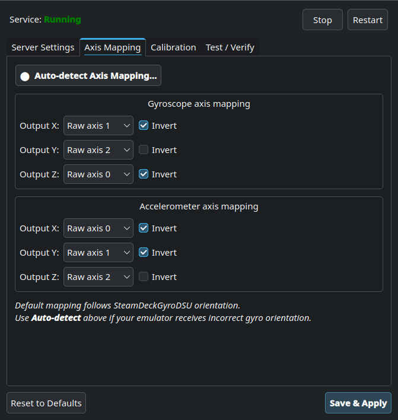
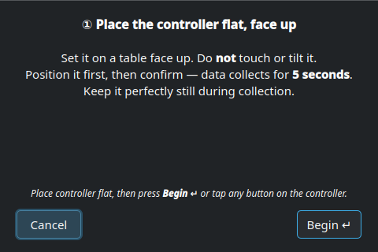
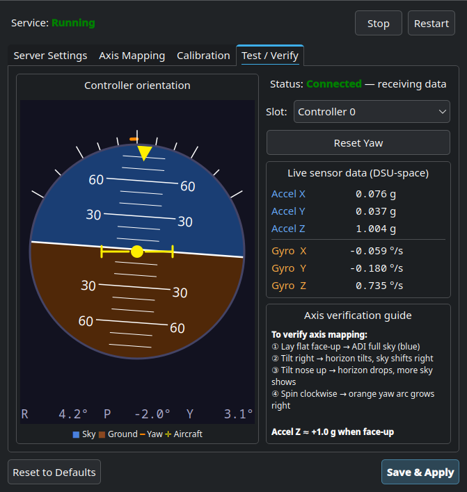

# SteamControllerGyroDSU

DSU / Cemuhook motion server for the **Steam Controller 2026** on Linux —
works on **Steam Deck**, **Bazzite**, and any generic Linux desktop.

Inspired by [SteamDeckGyroDSU](https://github.com/kmicki/SteamDeckGyroDSU) by kmicki.

---

## Features

- Streams **6DoF gyro + accelerometer** data over the DSU (Cemuhook) protocol
- Supports up to **4 Steam Controllers simultaneously** (slots 0–3)
- Works via **Bluetooth**, **USB-C**, and the **Proteus Puck** wireless dongle
- Runs alongside **SteamDeckGyroDSU** — use both at the same time on Steam Deck
- Automatic **gyro bias calibration** (activates when the controller is held still for ~2 s)
- Runs as a **systemd user service** — starts automatically at login
- Compatible with **Eden**, **Ryujinx**, **Cemu**, and any Cemuhook-compatible emulator

---

## GUI Configuration Tool

`sc2gyrodsu-config` is a graphical tool bundled with the installation.

### Axis Mapping tab
Remap raw sensor axes if your controller's gyro axes are swapped or inverted.
Use the **Auto-detect Axis Mapping** wizard to detect the correct mapping automatically
by following a short set of guided gestures.



### Axis Wizard
Step-by-step guided detection. Read each instruction, position the controller,
then press **Begin ↵** or tap any button on the controller to start each 5-second
capture window.



### Test / Verify tab
Live **Attitude Direction Indicator (ADI)** shows controller orientation in real time.
Use it to verify your axis mapping is correct after running the wizard.

- Sky (blue) fills the display when the controller is face-up
- The horizon tilts and shifts as you roll and pitch
- The orange arc around the outside shows accumulated yaw
- Numeric R / P / Y readout at the bottom



### Calibration tab
Run a manual gyro bias calibration. Hold the controller still for the duration
of the capture to zero out sensor drift.

---

## Install

### One-click (Steam Deck / Bazzite Desktop Mode)

Download the installer shortcut and double-click it on your Desktop:

**[⬇ Download Installer](https://github.com/TyanColte/Steam-Controller-GyroDSU/releases/latest/download/SteamControllerGyroDSU.desktop)**

The installer will:
1. Copy the daemon and GUI tool to `~/SteamControllerGyroDSU/`
2. Install and enable the systemd user service
3. Install udev rules (so the controller is accessible without root)
4. Create Desktop shortcuts for the config tool, updater, and uninstaller
5. Install the application icon

### Manual install from release zip

```bash
# Download and extract the latest release
curl -L -o /tmp/setup.zip \
  https://github.com/TyanColte/Steam-Controller-GyroDSU/releases/latest/download/SteamControllerGyroDSUSetup.zip
unzip /tmp/setup.zip -d /tmp/
bash /tmp/SteamControllerGyroDSUSetup/install.sh
```

---

## Emulator Setup

Point your emulator's DSU / Cemuhook motion source at:

| Setting | Value |
|---------|-------|
| IP | `127.0.0.1` |
| Port | `26761` |
| Slot | 0 = first controller, 1 = second, … |

### Eden / Ryujinx / Sudachi
`Settings → Controls → Motion → DSU Server → 127.0.0.1:26761`

### Cemu
`Settings → GamePad Motion Source → DSU1 → 127.0.0.1:26761`

---

## Using alongside SteamDeckGyroDSU

Run [SteamDeckGyroDSU](https://github.com/kmicki/SteamDeckGyroDSU) on the default
port `26760` for the Steam Deck's built-in gyro, and this service on `26761` for your
Steam Controller. Add both servers in your emulator:

| Port | Source |
|------|--------|
| `26760` | Steam Deck built-in gyro (SteamDeckGyroDSU) |
| `26761` | Steam Controller 2026 (this service) |

---

## First-Time Setup Tips

1. **Run the Axis Wizard** after installing — it detects the correct sensor axis mapping
   for your controller in under a minute.
2. **Run Calibration** after the wizard — the axis remap invalidates any stored bias,
   so a fresh calibration eliminates gyro drift.
3. **Reset Yaw** in the Test tab if the yaw reading has drifted (there is no
   magnetometer, so yaw integrates over time).

---

## Uninstall

Double-click **Uninstall SteamControllerGyroDSU** on your Desktop,
or run:

```bash
~/SteamControllerGyroDSU/uninstall.sh
```

---

## Update

Double-click **Update SteamControllerGyroDSU** on your Desktop,
or run:

```bash
~/SteamControllerGyroDSU/update.sh
```

---

## Building from Source

```bash
# Dependencies (Ubuntu / Debian)
sudo apt install cmake g++ pkg-config libhidapi-dev libudev-dev qt6-base-dev libgl1-mesa-dev

# Build
git clone https://github.com/TyanColte/Steam-Controller-GyroDSU.git
cd Steam-Controller-GyroDSU
cmake -B build -DCMAKE_BUILD_TYPE=Release
cmake --build build --parallel

# Binaries
# build/sc2gyrodsu        — DSU daemon
# build/sc2gyrodsu-config — GUI config tool (requires Qt6)
```

---

## License

MIT License — Copyright (c) 2026 TyanColte

Permission is hereby granted, free of charge, to any person obtaining a copy
of this software and associated documentation files (the "Software"), to deal
in the Software without restriction, including without limitation the rights
to use, copy, modify, merge, publish, distribute, sublicense, and/or sell
copies of the Software, and to permit persons to whom the Software is
furnished to do so, subject to the following conditions:

The above copyright notice and this permission notice shall be included in all
copies or substantial portions of the Software.

THE SOFTWARE IS PROVIDED "AS IS", WITHOUT WARRANTY OF ANY KIND, EXPRESS OR
IMPLIED, INCLUDING BUT NOT LIMITED TO THE WARRANTIES OF MERCHANTABILITY,
FITNESS FOR A PARTICULAR PURPOSE AND NONINFRINGEMENT. IN NO EVENT SHALL THE
AUTHORS OR COPYRIGHT HOLDERS BE LIABLE FOR ANY CLAIM, DAMAGES OR OTHER
LIABILITY, WHETHER IN AN ACTION OF CONTRACT, TORT OR OTHERWISE, ARISING FROM,
OUT OF OR IN CONNECTION WITH THE SOFTWARE OR THE USE OR OTHER DEALINGS IN THE
SOFTWARE.
